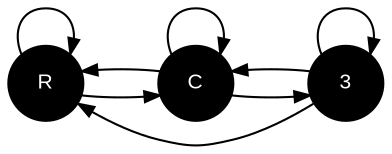

# RC3-Framework

Tutorials on fundamental algorithms and data structures for modelling complex systems

## Assignments

### 19.01.24
- Write a function that moves each vertex in a given graph to the average position of its neigbours