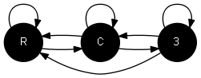

# RC3-Framework

Fundamental algorithms and data structures for modelling complex systems

## Assignments

### 19.02.09
- Build a rectangular tileset and generate 10 different tilings
- Implement a custom `TileModelInitializer` that prescribes all tiles on the boundary

### 19.01.31
- Write a function that creates a square grid graph where each vertex has a consistent 1-ring neighborhood (degree 4 with same orientation)
- Assign a color to interior vertices and a different color to boundary vertices

### 19.01.29
- Add vertex colors to the current Graph class
- Write a display class that visualizes vertex colors
- Write a function that sets the color of each vertex to the average of its neighbors

### 19.01.24
- Write a function that moves each vertex in a given graph to the average position of its neigbours